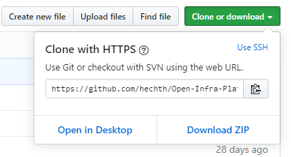

# Git Process

This short guide shows you how to use Git processes for better structuring a group project, like the OpenInfraPlatform.

## Content 

1. [Git Setup](#GitSetup)
	* [Prerequisites](#Prerequisites) 
	* [Fork the repository](#Fork)
2. [Git Workflow](#Workflow) 
	* [Updating from main repository](#Updating)
	* [Creating a branch](#Create_branch)
	* [Branch naming convention](#Naming_convention)
	* [Submit changes](#Submit)
	* [Pull request](#Pull_request)

##  Git Setup

*NOTE:* We provide `git` bash commands in this document. You are welcomed to use any git-UI of your liking as well.

###  Prerequisites 

Before you can proceed to work with `Git`, there are several steps, which have to be done up front.

1. Installation of *Git* - find [here](https://git-scm.com/book/en/v2/Getting-Started-Installing-Git).
2. Creation of *GitHub account* - find [here](https://github.com/).

###  Fork the repository

1. Go to OpenInfraPlatform [repository](https://github.com/tumcms/Open-Infra-Platform).

2. Login to your account and *Fork* OpenInfraPlatform to your account. 
   Now there is `https://github.com/<your_username>/Open-Infra-Platform`. 
   This is your *origin* repository (default). 

3. *Clone* your repository to local machine.

	- Open your File Explorer and select the folder, where you want to clone OpenInfraPlatform (e.g. `C:\dev`). 
      Right mouse click in this folder and select *Git Bash Here*.

	- To start the download write out in the window, which you have opened, in the command line:
	 > `git clone https://github.com/<your_username>/Open-Infra-Platform.git`

	*HINT:* The link after `git clone` can also be copy-pasted directly from GitHub after forking a repository from:

 4.  To add an additional remote repository, write out in the command line:
	 > `git remote add tumcms https://github.com/tumcms/Open-Infra-Platform.git `
    
    This adds a link to the official repository that you have forked, named `tumcms`.
	Adding a remote repository gives you an opportunity to *fetch* all changes from the official repository.   
	You can read more on updating your fork [here](#Updating). 

	As a result you will have two remote repositories: 

	- **origin** linked to `https://github.com/<your_username>/Open-Infra-Platform`, which is your repository.

	- **tumcms** linked to `https://github.com/tumcms/Open-Infra-Platform`, which is the official repository.

##  Git Workflow

Here you will find description about Git Workflow you need when working with OpenInfraPlatform. 

###  Updating your fork from main repository 

Once you have [added the official remote](#Remote), you can update your local repository with all changes made in the official repository. 

**NOTE: It is highly recommended to update your local repository every time you start working on it. 
Otherwise, you will not have access to the most recent changes.** 

1. Open OpenInfraPlatform source folder and select *Git Bash Here*. 

2. Add all updates to your local repository. 

	Write out in the command line:
	 > `git pull tumcms development`
    
    where:

	  * `tumcms` is the name you gave to the OpenInfraPlatform official repository remote (`https://github.com/tumcms/Open-Infra-Platform`) when [adding remote](#Remote). 
	  * `development` is the name of the branch in this repository you wish to pull.

3. Update your **origin** repository.

	Write out in the command line:
	 > `git push origin development` 

    where:

	* `origin` is the name of your remote repository (`https://github.com/<your_username>/Open-Infra-Platform`). 
	
	* `development` is the name of the branch you wish to push to your remote repository. 

Now you have both your repositories (local and remote) updated to the latest stage. 

###  Creating a branch

Before creating any changes, create new branch (aka "feature branch"). 
 
1. Open OpenInfraPlatform source folder and select *Git Bash Here*. 
	
2. Create new branch.

	Write out in the command line:
   > `git checkout -b [branchname]` 
   
    e.g.
   > `git checkout -b Fixing_Bugs`

Please consult our [Branch naming convetion](#Naming_convention) on how to name feature branches.

###  Branch naming convention

TODO.

###  Submit changes 

1. Open OpenInfraPlatform source folder and select *Git Bash Here*. 

1. After creating some changes, *add* these changes:

	Write out in the command line:
	 > `git add [filename]` 

	This will add changes of one file to a commit. 

	**OR** write out:
	 > `git add *`
	 
	This will add all changes you have made when working to a commit. 

1. *Commit* changes:

	Write out in the command line:
	 > `git commit -m "Commit message"` 
     
    e.g. 
    > `git commit -m "Changed behaviour of the XYZ class to now support UVW."` 
	 
	*NOTE:* Please be descriptive in your commit message as to what changes are involved in this commit.

1. *Push* changes to remote repository: 

	Write out in the command line:
	 > `git push origin [branchname] `
	 
	This will push changes to the correct branch and create remote branch with the same name if needed.

	As a result, your changes can be seen online on GitHub in your remote repository (`https://github.com/<your_username>/Open-Infra-Platform`). 

###  Pull request 

After successfully pushing changes to your remote repository, you should propose those changes to the official repository. 
This can be achieved with a *Pull request*.

1. Open the official repository on GitHub (https://github.com/tumcms/Open-Infra-Platform).

2. Initialize *pull request*:

	- If you pushed recently, GitHub notices that a new branch has been pushed recently, and it will suggest creating a new *pull request*. Select *Compare & pull request*. 

	- Alternatively, you can select *Pull requests*. There you can manually create *New pull request*. 
      This will open a new page, where you can select which branch you want to propose to merge in what another branch. 
      As you compare changes not only between two different *branches*, but also between different *forks*,
       you should choose the option to *compare across forks*. As a result, you will have four selections possible, instead of two:
		
		- For *base repository* select *tumcms/Open-Infra-Platform*.

		- For *base* select *development*.

		- For *head repository* select *<your_username>/Open-Infra-Platform*.

		- For *compare* select *[branchname]* (e.g. Fixing_Bugs).

3. On the new page you have an option to describe the changes you have made. 
   Please be descriptive on what changes you have made:
    - include names/locations/parts of project/of all files you have changed
    - describe main changes you have made
    - if your pull request fixes an issue, include a reference `fixes #[issue_nr]`

4. Assign *reviewers* of your changes.

5. Assign *Labels* to your *pull request*.

6. Select *Create pull request*.

7. Resolve any comments you receive and be constructive!

