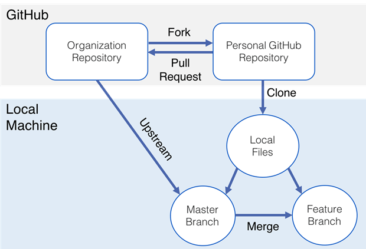

# Git Workflow

Here you will find description about Git Workflow you need working with OpenInfraPlatform

## Prerequisites 

Before you can proceed to work with Git, there are several steps, which have to be done before Installation: 

1. Installation of **Git** - find [here](https://git-scm.com/book/en/v2/Getting-Started-Installing-Git)
2. Creation of **GitHub account** - find [here](https://github.com/)

## Fork the repository

1. Go to OpenInfraPlatform on [GitHub](https://github.com/tumcms/Open-Infra-Platform).

2. Login to your account and *Fork* OpenInfraPlatform to your account. Now there is https://github.com/<your_username>/Open-Infra-Platform. This is your **origin** repository. 

3. *Clone* your repository to local machine.

	- Open your File Explorer and select the folder, where you want to clone OpenInfraPlatform (e.g. C:\dev). Right mouse click in this folder and select *Git Bash Here*.

	- In the window, which you have opened, in the command line write out *git clone https://github.com/<your_username>/Open-Infra-Platform.git* . This will start a download.

 4.  Add remote:  In the command line write out *git remote add tumcms https://github.com/tumcms/Open-Infra-Platform.git*. 

	Adding a remote repository gives you an opportunity to *fetch* all changes from the official repository. While working with OpenInfraPlatform, official repository is https://github.com/tumcms/Open-Infra-Platform. For this reason, it is desired to name this remote **tumcms**, to distinguish it from your **origin** remote repository.  

	[More information about updating your fork](#Updating). 

	As a result you will have two remote repositories: 

		 Your **origin** repository (https://github.com/<your_username>/Open-Infra-Platform).

		 **tumcms** repository (https://github.com/tumcms/Open-Infra-Platform).

## Submit changes 

1. Before creating any changes, create new branch: 
 
	- Open OpenInfraPlatform folder and select *Git Bash Here*. You also can open **Git Bash** and write out in the command line *cd "<Path to OpenInfraPlatform>"* (e.g  *cd  "C:\dev\Open-Infra-Platform"*).

	- In the command line write out *git checkout -b <branchname>* (e.g. *git checkout -b Fixing_Bugs*).

2. After creating some changes, *add* these changes:

	- In the command line of **Git Bash** write out *git add <filename>* to add changes of one file to a commit. 

	- **OR** write out -git add *- to add all changes you have made while working to a commit. 

3. *Commit* changes:

	- In the command line write out *git commit -m "Commit message"* (e.g. *git commit -m "Fixed Bugs"*). **NOTE:** Please be descriptive in your commit message as to what changes are involved in this commit.

4. *Push* changes to remote repository: 

	- In the command line write out *git push origin*. As a result, your changes are online on GitHub in your remote repository (https://github.com/<your_username>/Open-Infra-Platform). 

##Pull request 

After successfully pushing changes to your remote repository, you should merge your branch with the official repository. This can be achieved with *Pull request*:

1. Open your remote repository on GitHub (https://github.com/<your_username>/Open-Infra-Platform).

2. Initialize *pull request*:

	- As you open your remote repository on GitHub, you will see, that GitHub has noticed, that new branch has been pushed recently, and it was suggesting creating a new *pull request*. Select *Compare & pull request*. 

	- Alternatively, you can select *Pull requests*. There you can manually create *New pull request*. This will open a new page, where you will be able to select, which branch you want to pull in what another branch. As your compare changes not only between to different *branches*, but also between different *forks*, you should choose an option to *compare across forks*. As a result, you will have four selections possible, instead of two:
		
		- For *base repository* select *tumcms/Open-Infra-Platform*.

		- For *base* select *development*.

		- For *head repository* select *<your_username>/Open-Infra-Platform*.

		- For *compare* select *<branchname>* (e.g. Fixing_Bugs).

3. On the new page you have an option to comment all changes, you have made. Please be descriptive commenting all changes (include names of all files you have changed; describe main changes you have made to these files). 

4. Assign *reviewers* of your changes.

5. Assign *Labels* to your *pull request*. (e.g. bug)

6. Select *Create pull request*.

##  Updating from main repository 

Once you have *added a remote*, you can update your local repository with all changes made in the official repository. **It is highly recommended to update your local repository every time you start working with it. Otherwise, you will not have access to recent changes**. 

1. Add all updates to your local repository: 

	- In **Git Bash**, which is working in OpenInfraPlatform folder, in the command line write out *git pull tumcms development*.  

	*tumcms* is a name you gave to OpenInfraPlatform official repository (https://github.com/tumcms/Open-Infra-Platform) while [adding remote](#Remote). 
	
	*development* is a name of the main branch in this repository. 

2. Update your **origin** repository:

	- In the command line write out *git push origin development*. 

	*origin* is a name of your remote repository (https://github.com/<your_username>/Open-Infra-Platform). 
	
	*development* is a name of the main branch in your remote repository. 

Now you have both your repositories (local and remote) updated. 

## Branch naming convention
