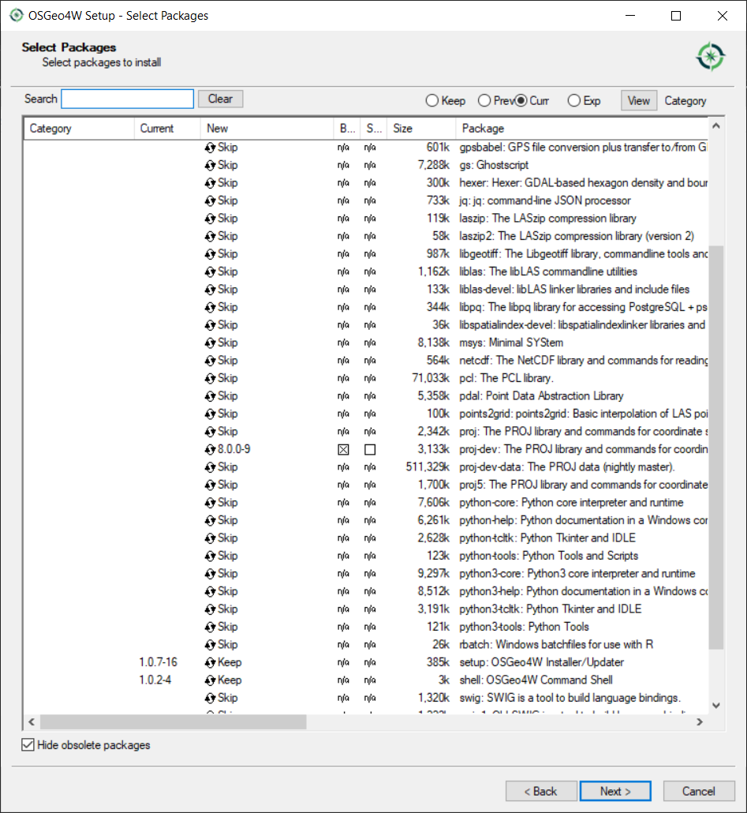

# Compiling OpenInfraPlatform 

Guide on how to compile the project TUM OpenInfraPlatform.

*NOTE:* This document is only a snapshot of the current state (November 2020) and may become obsolete in the future.

## Content 

1. [Prerequisites](#Prerequisites)
    * [Development environment](#devenv)
    * [Download source code](#Source_code)
    * [Third-party libraries](#thirdparty)
2. [Preparing VS solution](#Setup) 
3. [Building the OpenInfraPlatform in Visual Studio](#Building_OIP) 
	* [First time](#FirstTime)
	* [Generating IFC early binding libraries](#generating_EarlyBinding)
	* [Compiling user interface](#Compiling_interface)
    * [Generating documentation](#Generating_Doc)

##  Prerequisites 

These steps need to be completed before you can proceed even to think to compile OIP.

*NOTE:* The OIP only works with the versions listed. 
No guaranty is given for other versions.

###  Development environment

You will need to install:

1. **Visual Studio 2017** - find [here](https://my.visualstudio.com/Downloads?q=visual%20studio%202017&wt.mc_id=o~msft~vscom~older-downloads).
2. **CMake 3.17.0** - find [here](https://cmake.org/download/).
3. **git** - find [here](https://git-scm.com/downloads).

###  Download source code 

 Fork & clone [Open-Infra-Platform repository](https://www.github.com/tumcms/Open-Infra-Platform).

*NOTE:* for detailed instructions consult our [Git Guidelines](./GitProcess.md).

###  Third-party libraries

4. **Qt 5.12.1** - find [here](https://www.qt.io/download-open-source).

	*	Download Qt Online Installer 
	*	While your computer is downloading Qt installer, create Qt account. 
	*	Sign in with your new account to Qt installer and select directory, where Qt will be installed (`C:\Qt` should be default option).
	*	Select components to install:

		* Check the *Archive* box
		* Click *Filter*
		* Open section **Qt 5.12.1**
		* **Mandatory:** Select *binaries x64 msvc2017*
		* **Mandatory:** Select *mingw*
		
		

*NOTE:* There are components, which Qt Online Installer selects as default options. You can uncheck these components for saving computer memory.

5. **Boost 1_65_1** - find [here](https://sourceforge.net/projects/boost/files/boost-binaries/1.65.1/boost_1_65_1-msvc-14.1-64.exe/download).

	* Create a folder `C:\thirdparty` and install **Boost 1_65_1** to `C:\thirdparty\vs2017\x64\boost_1_65_1`.
	* Add this path to the environment variables. (Create new environment variable called `Boost_INCLUDE_DIR`. This variable should point to the binary folder, where **Boost 1_65_1** is staged (e.g. `C:\thirdparty\vs2017\x64\boost_1_65_1`).

6. **Anaconda 2** (version with Python 2.7) - find [here](https://repo.anaconda.com/archive/Anaconda2-2019.10-Windows-x86_64.exe). 
7. **PROJ**

	*	Download OSGeo4W64 Installer - find [here](http://download.osgeo.org/osgeo4w/osgeo4w-setup-x86_64.exe).
	*	In installer, select *Advanced Install*.
	*	Choose to install from Internet.
	*	Select directory, where PROJ will be installed.

*NOTE:* CMake expects it at `C:\OSGeo4W64`, which should be the default option. If you deviate from this, please set the `OIP_PROJ_DIR` variable correspondingly.

  * Select local package directory (e.g. `C:\OSGeo4W64\local`).
  * Select `https://osgeo4w-oslandia.com/` as a download site.
  * Select components to install:
		
    * Open *Commandline_Utilities*
    * Find *proj-dev* package 
    * Click on *skip* to refresh the line.
    * Select binary (*Bin*) package (the left column).
		
    

    * Finish the installation.

8. **Doxygen**
	*	Download Doxygen Installer - find [here](http://doxygen.nl/files/doxygen-1.8.20-setup.exe).
	*	Install Doxygen

##  Preparing VS solution 

1. Launch CMake.
2. In the line *Where is the source code:* input the path to your clone's source folder (e.g. `C:\dev\Open-Infra-Platform`).
3. In the line *Where to build the binaries:*  input the path to the binaries folder (e.g. `C:\dev\build\Open-Infra-Platform`). 

*NOTE:* The source folder as well as *Program Files* and *Windows* folders are **invalid** locations for the binary folder.

4. Check the *Grouped* and *Advanced* boxes (top right in CMake GUI).
5. Click *Configure*. 
6. Select the Generator:
	* Select *Visual Studio 15 2017 Win64*.
	* Select *x64*
	* Write *host=x64* as optional toolset.

7. For detailed descriptions of all configuration options that can be selected in the CMake GUI, consult [CMake options documentation](./CMakeOptions.md).

*NOTE:* A few (red) warnings in the lower window of CMake can be ignored as long as it states *Configuring done* at the end.

8. After configuration process has successfully finished, click *Generate*.
9. After generation process is done click *Open Project*. It will open the OpenInfraPlatform solution in Visual Studio.

##  Building the OpenInfraPlatform in Visual Studio 

###  First Time

When compiling OpenInfraPlatform for the first time, these projects should first be built.

* Execute **Get_OKLABI.cmd** in the `external` folder (e.g. `C:\dev\Open-Infra-Platform\external`) 
  to prevent an error during the build process. 
  After the execution of **Get_OKLABI.cmd**, it's necessary to *configure* and *generate* OpenInfraPlatform project once again in CMake.

* In the *project browser* open *OpenInfraPlatform* project folder. 
  In the folder *Commands* build  **OpenInfraPlatform.Commands.UpdateBoostMpl**.

* Build all projects within the *Copy* project folder. 

*NOTE:* This only needs to happen when compiling for the first time, or after a deletion of the binaries folder.

###  Generating IFC early binding libraries

*NOTE:* If you are using OpenInfraPlatform only with point clouds, you can skip these steps.

1. Find the folder *ExpressBindingGenerator*. Build project **OpenInfraPlatform.ExpressBindingGenerator**.

2. In the folder *ExpressBindingGenerator* find the folder *Commands*. 
   There you should build project **Commands.GenerateEarlyBinding.IFC?** where *?* stands for the chosen IFC version.

*NOTE:* By default settings, this will build **Commands.GenerateEarlyBinding.IFC4X3_RC1**. 
If you want to change the schema to another, you need to select the corresponding option in CMake and *generate* in CMake again.

*NOTE:* To generate faster, make sure you have compiled **OpenInfraPlatform.ExpressBindingGenerator** with *Release* configuration.

3. **Important**: Now open CMake and select *Generate* to include newly generated IFC early binding code in the solution.

4. Find the folder *EarlyBinding*. Build project **OpenInfraPlatform.IFC?**.

*NOTE:* This step may take quite some time.

###  Compiling user interface

*NOTE:* Build dependencies are set through CMake, so building only the last step should automatically build all.

1. *Build* project **OpenInfraPlatform.Base**.
1. If you are using point clouds *build* project **OpenInfraPlatform.PointCloudProcessing**.
1. *Build* project **OpenInfraPlatform.Core**.
1. *Build* project **OpenInfraPlatform.Rendering**.
1. *Build* project **OpenInfraPlatform.UI**.

###  Generating documentation

Build the project **OpenInfraPlatform.GenerateDocumentation** within *Commands* folder in the solution.

*NOTE:* Read more about Doxygen in our [guidelines](./DoxygenHelp.md).

Please consult our [CMake options documentation](./CMakeOptions.md) for different options available for customizing the doxygeneration.

