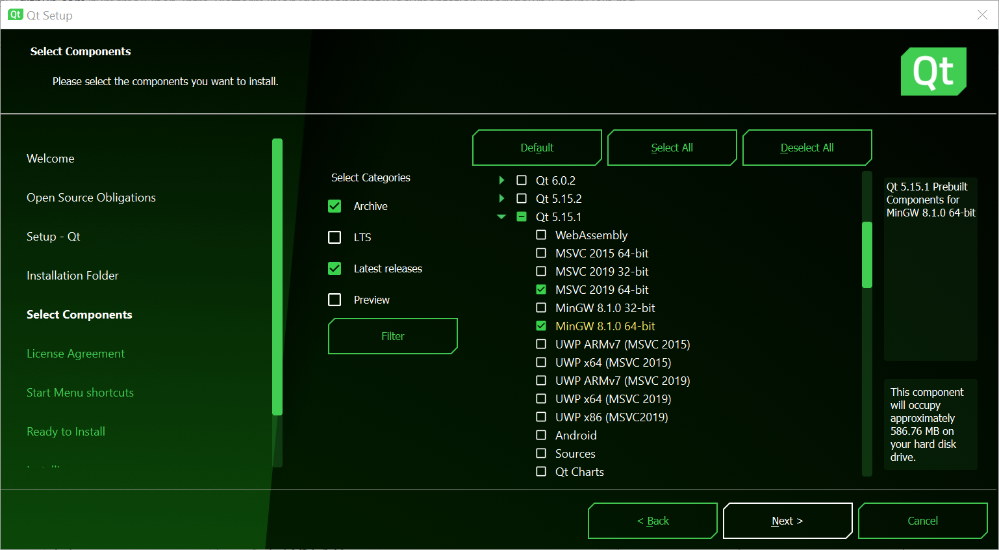
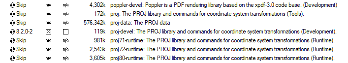
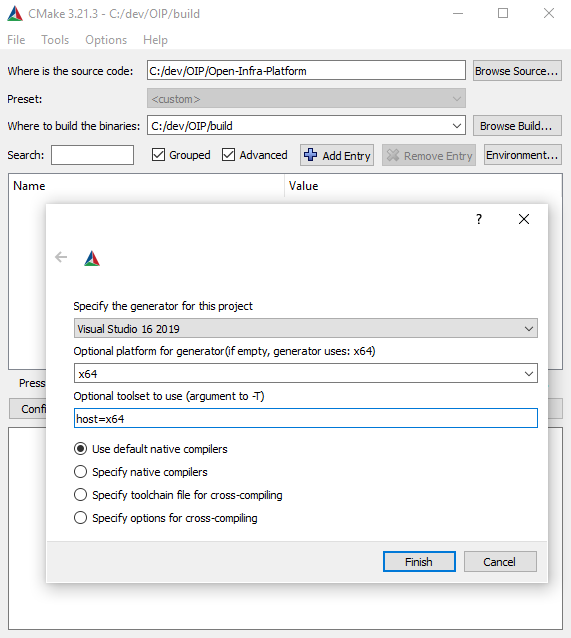

# Setting up and Compiling TUM Open Infra Platform 

Guide on how to compile the project TUM Open Infra Platform (OIP) from scratch.

*NOTE:* Additional information about known errors and warnings is provided in [FAQ](./FAQ.md).

## Content 

1. [Prerequisites](#Prerequisites)
    * [Development environment](#devenv)
    * [Download source code](#Source_code)
    * [Third-party libraries](#thirdparty)
2. [Preparing VS solution](#Setup) 
3. [Building the Open Infra Platform in Visual Studio](#Building_OIP) 
	* [First time](#FirstTime)
	* [Generating IFC early binding libraries](#generating_EarlyBinding)
	* [Compiling user interface](#Compiling_interface)
    * [Generating documentation](#Generating_Doc)

##  Prerequisites 

These steps need to be completed before you can proceed even to think to compile OIP.

*NOTE:* The OIP only works with the versions listed (see [tested versions](./FAQ.md#version) for further combinations).

###  Development environment

You will need to install:

1. **Visual Studio 2019** - find [here](https://visualstudio.microsoft.com/de/downloads/).
2. **CMake 3.20.5** - find [here](https://cmake.org/files/PreviousRelease/cmake-3.20.5-windows-x86_64.msi).
3. **git** - find [here](https://git-scm.com/downloads).

###  Download source code 

Fork & clone [Open-Infra-Platform repository](https://www.github.com/tumcms/Open-Infra-Platform).

*NOTE:* for detailed instructions consult our [Git Guidelines](./GitProcess.md).

###  Third-party libraries

4. **Qt 5.15.1** - find [here](https://www.qt.io/download-open-source).

  * Download Qt Online Installer 
  * While your computer is downloading Qt installer, create Qt account. 
  * Sign in with your new account to Qt installer and select directory, where Qt will be installed (`C:\Qt` should be default option).

*NOTE:* OIP expects *Qt* at `C:\Qt`, which is the default option. If you deviate from this, please set the `OIP_QT_DIR` variable [correspondingly](./FAQ.md#libraries).

  * Choose Custom installation
  * (recommended) Deselect *Associate common file types with Qt creator*
  * Select components to install:

    * Check the *Archive* and *Latest releases* box
    * Click *Filter*
    * Open section **Qt 5.15.1**
    * **Mandatory:** Select *MSVC 2019 64-bit*
    * **Mandatory:** Select *MinGW 8.1.0 64-bit*
		

*NOTE:* There are components, which *Qt Online Installer* selects as default options. You can uncheck these components for saving computer memory.

5. **Boost 1_75_0** - [vs2019](https://sourceforge.net/projects/boost/files/boost-binaries/1.75.0/boost_1_75_0-msvc-14.2-64.exe/download)

	* Create a folder `C:\thirdparty` and install **Boost 1_75_0** to `C:\thirdparty\vs2017\x64\boost_1_75_0` or `C:\thirdparty\vs2019\x64\boost_1_75_0`.

*NOTE:* OIP expects *boost* at the path specified above. If you deviate from this, please set the `OIP_Boost_DIR` variable [correspondingly](./FAQ.md#libraries).

	* Add this path to the environment variables. (Create new environment variable called `Boost_INCLUDE_DIR`. This variable should point to the binary folder, where **Boost 1_75_0** is staged (e.g. `C:\thirdparty\vs2017\x64\boost_1_75_0` or `C:\thirdparty\vs2019\x64\boost_1_75_0`).

6. **Anaconda 2** (version with Python 2.7) - find [here](https://repo.anaconda.com/archive/Anaconda2-2019.10-Windows-x86_64.exe). 

7. **PROJ**

	*	Download OSGeo4W Installer - find [here](download.osgeo.org/osgeo4w/v2/osgeo4w-setup.exe).
	*	In installer, select *Advanced Install*.
	*	Choose to install from Internet.
	*	Select directory, where PROJ will be installed.

*NOTE:* OIP expects *PROJ* at `C:\OSGeo4W`, which is the default option. If you deviate from this, please set the `OIP_PROJ_DIR` variable [correspondingly](./FAQ.md#libraries).

  * Select local package directory (e.g. `C:\OSGeo4W\local`).
  * Select `https://download.osgeo.org/` as a download site.
  * Select components to install:
		
    * Open *Libs*
    * Find *proj-devel* package 
    * Click on *skip* to refresh the line and select version 8.1.1-1.
    * Select binary (*Bin*) package (the left column).
		

8. **Doxygen** & **DOT**
	*  Download & install Doxygen - find [here](https://sourceforge.net/projects/doxygen/files/rel-1.8.20/doxygen-1.8.20-setup.exe/download).
       * Default search path is `C:/thirdparty/doxygen/bin`
       * If deviating, please set the `DOXYGEN_EXECUTABLE` variable correspondingly
	*  Download & install DOT - find [here](https://graphviz.gitlab.io/_pages/Download/windows/graphviz-2.38.zip)
       * Default search path is `C:/thirdparty/graphviz_dot`
       * If deviating, please set the `DOXYGEN_DOT_EXECUTABLE` variable correspondingly

##  Preparing VS solution 

1. Launch CMake.
2. In the line *Where is the source code:* input the path to your clone's source folder (e.g. `C:\dev\Open-Infra-Platform`).
3. In the line *Where to build the binaries:*  input the path to the binaries folder (e.g. `C:\dev\build\Open-Infra-Platform`). 

*NOTE:* The source folder as well as *Program Files* and *Windows* folders are **invalid** locations for the binary folder.

4. Check the *Grouped* and *Advanced* boxes (top right in CMake GUI).
5. Click *Configure*. 
6. Select the Generator:
	* Select *Visual Studio 16 2019 Win64*.
	* Select *x64*
	* Write *host=x64* as optional toolset.

7. For detailed descriptions of all configuration options that can be selected in the CMake GUI, consult [CMake options documentation](./CMakeOptions.md).

*NOTE:* Plenty of red warnings in the log panel are [fine](./FAQ.md#cmake_warnings).

8. After configuration process has successfully finished, click *Generate*.
9. After generation process is done click *Open Project*. It will open the solution in Visual Studio.

##  Building the Open Infra Platform in Visual Studio 

###  First Time

When compiling OIP for the first time, these projects should first be built.

* In the *project browser* open *OpenInfraPlatform* project folder. 
  In the folder *Commands* build  **OpenInfraPlatform.Commands.UpdateBoostMpl**.

* Build all projects within the *Copy* project folder. 

*NOTE:* This only needs to happen when compiling for the first time, or after a deletion of the binaries folder.

###  Generating IFC early binding libraries

*NOTE:* If you are using Open Infra Platform only with point clouds, you can skip these steps.

1. Find the folder *ExpressBindingGenerator*. Build project **OpenInfraPlatform.ExpressBindingGenerator**.

2. In the folder *ExpressBindingGenerator* find the folder *Commands*. 
   There you should build project **Commands.GenerateEarlyBinding.IFC?** where *?* stands for the chosen IFC version.

*NOTE:* By default settings, this will build **Commands.GenerateEarlyBinding.IFC4X3_RC1**. 
If you want to change the schema to another, you need to select the corresponding option in CMake and *generate* in CMake again.

*NOTE:* To generate faster, make sure you have compiled **OpenInfraPlatform.ExpressBindingGenerator** with *Release* configuration.

3. **Important**: Now open CMake and select *Generate* to include newly generated IFC early binding code in the solution.

4. Find the folder *EarlyBinding*. Build project **OpenInfraPlatform.IFC?**.

*NOTE:* This step may take quite some time.

###  Compiling user interface

*NOTE:* Build dependencies are set through CMake, so building only the last step should automatically build all.

1. *Build* project **OpenInfraPlatform.Base**.
1. If you are using point clouds *build* project **OpenInfraPlatform.PointCloudProcessing**.
1. *Build* project **OpenInfraPlatform.Core**.
1. *Build* project **OpenInfraPlatform.Rendering**.
1. *Build* project **OpenInfraPlatform.UI**.

###  Generating documentation

Build the project **OpenInfraPlatform.GenerateDocumentation** within *Commands* folder in the solution.

*NOTE:* This step may take quite some time.

Read more about Doxygen in our [guidelines](./DoxygenHelp.md).

Please consult our [CMake options documentation](./CMakeOptions.md) for different options available for customizing the doxygeneration.

