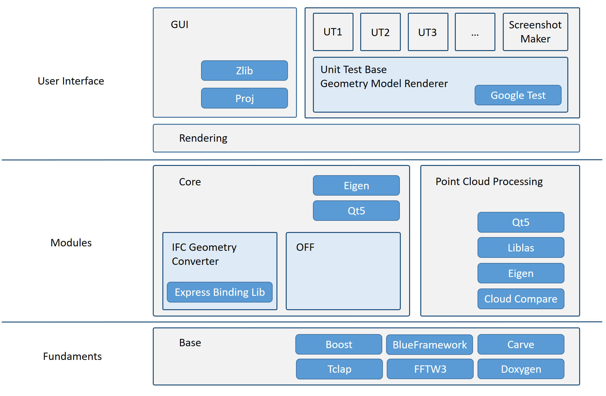
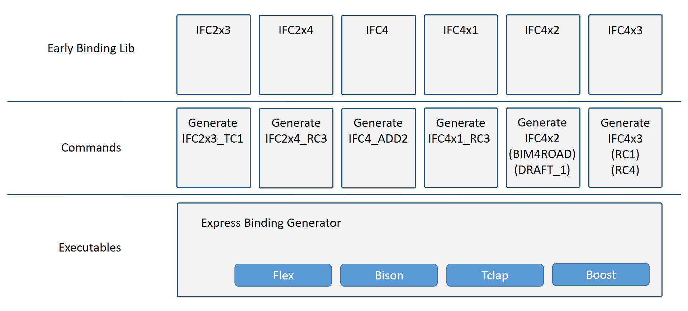

# Software Architecture

*NOTE:* This document shows the overall software architecture of the Open Infra Platform 
and the Express Binding Generator as of the current state (July 2021). 

## Content 

1. [Overall Software Architecture](#Overall_architecture)
    * [Fundaments](#Fundaments)
    * [Modules](#Modules)
    * [User Interface](#UI)
2. [Express Binding Generator](#Express_binding) 
	* [Executables](#Exec)
	* [Commands](#Commands)
	* [Early Binding Library](#Early_binding_lib)

##  Overall Software Architecture

This section gives a general overview of the software architecture of the Open Infra Platform 
with its core software modules together with their interrelations.
Furthermore, dependencies on third-party libraries are stated. 

###  Fundaments
The base module constitutes the backbone of the Open Infra Platform, 
with all of the other software parts building upon it. 
As its main part, several third-party libraries are linked here. 
Other than that, it also provides very fundamental elements like the IModel interface 
that is implemented by the upper layers for every supported file format (e.g., IFC and OFF) 
and will!!! hold all of the information read from the input files. 
Furthermore, classes and structures for georeferencing metadata and simple bounding boxes are given.

Linked third-party libraries:
* Boost (library for linear algebra, multithreading, and storage management; header-only)
* BlueFramework (open-source C++ 3D graphics rendering engine developed by TUM)
* Carve (constructive solid geometry library)
* Tclap (small and flexible library providing an interface for accessing and defining command line arguments; header-only)
* FFTW3 (computation of Fourier transformations; header-only)
* Doxygen (tool to generate documentation; header-only)
(main readme? -> oder seperates readme für alles thirdparty)
lizenzen readme -> nur noch link

###  Modules

The modules can be separated into two central parts. 
First of all, the Core module links to the third-party libraries Eigen and Qt.
It also comprises one submodule for the IFC and OFF file format each. 
In the case of IFC, the IFC Geometry Converter takes care of the geometric conversion processes. 
It makes use of the Express Binding Library, which is generated by the Express Binding Generator (Link nach unten), 
(and explained in further detail later on). 
The IFC file format supports all sorts of geometric representations 
ranging from boundary representation and constructive solid geometry to sweep volumes. 
This includes implicit as well as explicit geometric representations. 
In order to be able to render these complex geometries described in an IFC file, 
the _IFC Geometry Converter_ has to convert the geometric descriptions 
specified in IFC into a triangle mesh that can be understood by the rendering engine.
This step is based on the geometry kernel `carve`. 
Since IFC encompasses a multitude of representations and is constantly updating, 
only a subset of the IfcRepresentationItems are supported at the moment, 
focusing on the most frequently used ones. 
However, OIP is continuously expanding to cover more and more types of representations. 
To check which representation items are currently supported, 
the user can take a look at the (weiter oben)[List of supported IFC Representations](./SupportedIFCrepresentations.md). 
The other part of the Core module consists of the OFF (Object File Format) Geometry Converter. 
This format specifies tessellations of objects with the help of triangles, quadrilaterals, hexagons, and similar surfaces. 
The conversion process is a lot simpler in comparison to the IFC format 
since the OFF format is limited to this specific geometric representation.(skizze von helge figure 1 fbi) opi ohne the

(komischer anfang)And the other one being the _Point Cloud Processing_ module. 
This module enables the visualization of point clouds of the file format .bin (native CloudCompare format) and `.las`. (...) 
Additionally, octrees can be visualized, and basic point cloud processing functionalities are provided.
This point cloud module has references to the following third-party libraries:
* Qt5 (library providing prebuilt elements for the development of graphical user interfaces)
* Liblas (read and write geodata in .las format)
* Eigen (library for linear algebra, matrix and vector operations, numerical solvers, geometric transformations, and more)
* CloudCompare (point cloud processing)

By default, the Point Cloud Processing module is deactivated. 
In order to make use of it, the OIP needs to be built 
with the corresponding CMake option selected (for further details, see [CMake Options Documentation](Documentation/markdown/CMakeOptions.md)). 
A significant advantage is that the Core and the Point Cloud Processing module can be run simultaneously 
so that, e.g., one can open an IFC file and a point cloud 
at the same time to compare them to each other directly. (möglichst viele links zu anderne md files)

###  User Interface

The underlying part of the user interface is the Rendering module. 
This links to a self-written rendering engine called BlueFramework. 
Depending on the objects that are to be displayed, different types of shaders and effects are implemented. 
The Graphical User Interface is built on top of this, 
which has a 3D viewport to display geometric objects and several menus and buttons that provide functions to interact with them. 
The GUI bases on the Qt library, which has an extensive catalog of ready-to-use user interface elements. 
Other third-party libraries that the GUI uses are:
* Zlib (algorithms for compression and decompression of data)
* Proj (functionalities to calculate conversions between geodetic reference systems)

### Unit testing

On the other hand, there is the Unit Testing part, which bases on Google Test. 
Since many unit tests that are implemented in the OIP use visual comparison, 
the unit test base includes a geometry model renderer that allows rendering without the use of the Graphical User Interface. 
On top of that, there are various individual unit tests for IFC, OFF, and point clouds (and also some other more general unit tests?). 
These provide automated checking to guarantee that implemented functionalities are all still in place and working as expected. 
For the case of the IFC format, the [List of supported IFC Representations](./SupportedIFCrepresentations.md) 
provides information about which representations currently have at least one unit test in place.

##  Express Binding Generator

This section will give a short overview of how the Express Binding Generator is working. 
The general task of the Express Binding Generator is to read an IFC schema in the form of an EXPRESS schema definition 
and automatically create early binding C++ classes mirroring the IFC entities. 
This allows to adapt and support the newest IFC versions quickly (complire findet schon probleme). 
The Express Binding Generator consists of three main parts: 
the executables, the commands, and the early binding library. 
These will!!! be explained in more detail in the following.

 

###  Executables 
(hier skizze julian)

In the executables, the basic functionalities are defined, which state how the IFC express schemas are converted to C++ classes,
taking into account entities, inverse attributes, attributes, types, and SELECT clauses. 
A Yacc and Bison parser generates a corresponding meta-model representation in C++, 
which needs to overcome fundamental differences between C++ and EXPRESS.
The executables make use of the following third-party libraries:
* Flex (lexical analyzer generator)
* Bison (general-purpose parser generator)
* Tclap (small and flexible library providing an interface for accessing and defining command line arguments; header-only)
* Boost (library for linear algebra, multithreading, and storage management; header-only)

Limitation: kein where, keine FUNCTION, Rule, derive

###  Commands
(helper functionen zum direkt au VS sterten)
In this section, the selected express file is read, and then according to the schema, 
the C++ classes are generated. 
It is currently not possible to link various IFC versions simultaneously 
since they have overlapping classes with various differences(not yet adressed). 
Therefore one needs to select the desired IFC version for the build process, 
as described in the [CMake Options Documentation](Documentation/markdown/CMakeOptions.md). 

The supported IFC versions are:
* IFC2x3_TC1
* IFC2x4_RC3
* IFC4_ADD2
* IFC4x1_RC3
* IFC4x2 (BIMROAD and DRAFT_1)
* IFC4x3 (RC1 and RC4)

###  Early Binding Library

Once a specific command is executed and the IFC classes have been built, 
they are ready to use in the form of a library.
This gets linked to core module se above...

neuer Satz neue zeile (bei mehr als 80 zeichen, bei komma ...)
nicht futur
pdf von helge