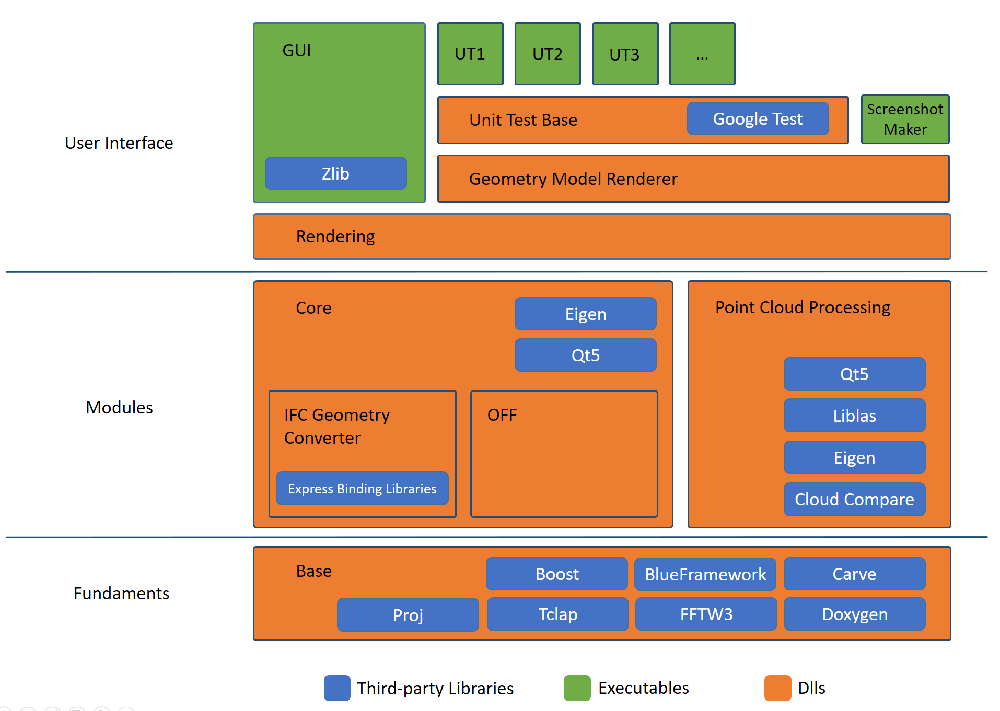

# Software Architecture

*NOTE:* This document shows the overall software architecture of the Open Infra Platform and the Express Binding Generator as of the current state (July 2021). 

## Content 

1. [Overall Software Architecture](#Overall_architecture)
    * [Fundaments](#Fundaments)
    * [Modules](#Modules)
    * [User Interface](#UI)
2. [Express Binding Generator](#Express_binding) 
	* [Executables](#Exec)
	* [Commands](#Commands)
	* [Early Binding Library](#Early_binding_lib)

##  Overall Software Architecture

This section will give a general overview of the software architecture of the Open Infra Platform with its core software modules and how they are connected.
Furthermore, dependies on third party libraries are stated. 

###  Fundaments
Base lies the backbone for everything else that follows. Main part are the third party libraries that are linked here. Other than that we have only IModel.h Interface, GeorefMetaData.h, and BBox.h.

Third Party Libraries:
* Boost (header-only, library for linear algebra, mutlithreading and in general storage management)
* BlueFramework (open-source rendering engine developed by TUM)
* Carve (library to work with constructive solid geometry)
* Tclap (header-only, very small and flexible library providing an interface for accessing and defining command line arguments)
* FFTW3 (header-only, used for computing fourier trasformations)
* Doxygen (header-only, tool to generate documentation)

###  Modules

The modules are sperate in two big parts. First of all we have the Core section which links to the third party libraries Eigen () and Qt5 ().
In here we have two differnet file formats that we support. First of all, we have the IFC Geometry Converter. It makes you of the Express Binding Library, which is generated by the Express Binding Generator, explained more in Detail later on. The IFC file format supports all sorts of geometric representations ranging from boundary representation and constructive solid geometry up to sweep volumes. So implicit as well as explicit geometric representations. In order to be able to render the geometries described in an IFC file the task of the IFC Geometry Converter is to convert the geometric descriptions specified into a format that can be understood by the renderer. In our case these are triangles. Since IFC is updating constantly (adding and changing IfcRepresenationItems) we also are always trying to keep up to date. Unfortunately not all IfcRepresentationItems are supported at the moment. However, the OIP already supports many of them. To keep track of what is supported you can take a look at [List of supported IFC Representations](./SupportedIFCrepresentations.md). The other part that is also part of Core is the OFF (Object File Format) Geometry Converter. This format is used to specify tessellations of objects with triangles, quadralaterals, hexagons, and so on. The conversion process is a lot simpler that for the IFC format since the format is limited to this type og geometric representation.

On the other hand, there is the Point Cloud Processing module. This makes it possible to visualize point clouds of the file type x, y, and z.
This module has references to the third party libraries:
* Qt5 (library that provides elements for the development of graphical user interface)
* Liblas (used to read and write geodata in LAS format)
* Eigen (library for linear algebra, matrix and vector operations, numerical solvers, geometric transformations, and similar stuff)
* Cloud Compare (point cloud processing)

By default the point cloud processing part is deactivated. In order to make use of it the corresponding CMake option needs to be selected (see [CMake Options Documentation](Documentation/markdown/CMakeOptions.md)). The good thing is that the differnet modules can be run simultaneously so that, e.g., one is able to open an IFC file and point cloud at the same time to dirrectly compare them to each other.

###  User Interface

The underlying part of the user interface is the Rendering module. This contains a self written rendering engine. With the help of this things can be displayed. Depending on the displayed object different types of shaders are implemented (also mention blueframework). On top of this we have the Graphical User Interface. It bases on the Qt5 library which has a big catalogue of ready to use user interface elemtents. Other linked third party libraries are:
* Zlib (provides alorithms for compression and decompression of data)
* Proj (library that provides functionalities to make conversions between geodetic reference systems)

On the other hand there is also the Unit Testing part. This bases on the google test. Since many unit test base on the visual comparison (visual test) the unit test base includes a geometry model renderer that allows rendering without the use of the graphical user interface. On top of there a various unit tests for IFC, OFF, point clouds and also some other more general unit tests? These provide automated checking whether the implemented funtionalities are all still in place and working. For the case of IFC the [List of supported IFC Representations](./SupportedIFCrepresentations.md) provides information which representation currently has a unit testing in place.

##  Express binding Generator

This section will give a short overview of how the expresss binding generator is working. The general task of the express binding generator is to read a specific IFC schema in the form of a express file to create c++ classes for all of the ifc entities. This allows the quick adaption and support of the newest IFC verisons. The express binding generator consists of three main parts: the executables, the commands, and the early binding library. These will be explained in more detail in the following. 

###  Executables 

Here the basic functionalities are defined, which state how the IFC express schemas are converted to c++ classes, taking into account entities, inverse attributes, attributes, where clauses and so on.
We have links to the third party libraries:
* Flex (lexical analzyer generator)
* Bison (general purpose parser generator)
* Tclap (header-only, very small and flexible library providing an interface for accessing and defining command line arguments)
* Boost (header-only, library for linear algebra, mutlithreading and in general storage management)

###  Commands

This is the part where the express files  (one specific selected one) are read and then according to the schema the c++ classes are generated in order to use them later on. It is currently not possible to build various IFC versions at the same time since they have overlapping classes but also various differences. Therefore one needs to select the IFC version in the [CMake Options Documentation](Documentation/markdown/CMakeOptions.md). 
Supported IFC Versions are:
* IFC2x3_TC1
* IFC2x4_RC3
* IFC4_ADD2
* IFC4x1_RC3
* IFC4x2 (BIMROAD and DRAFT_1)
* IFC4x3 (RC1 and RC4)

###  Early Binding Library

Once a specific command is execute and the IFC classes have beein built there are ready to use in the form of a library.