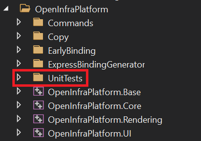
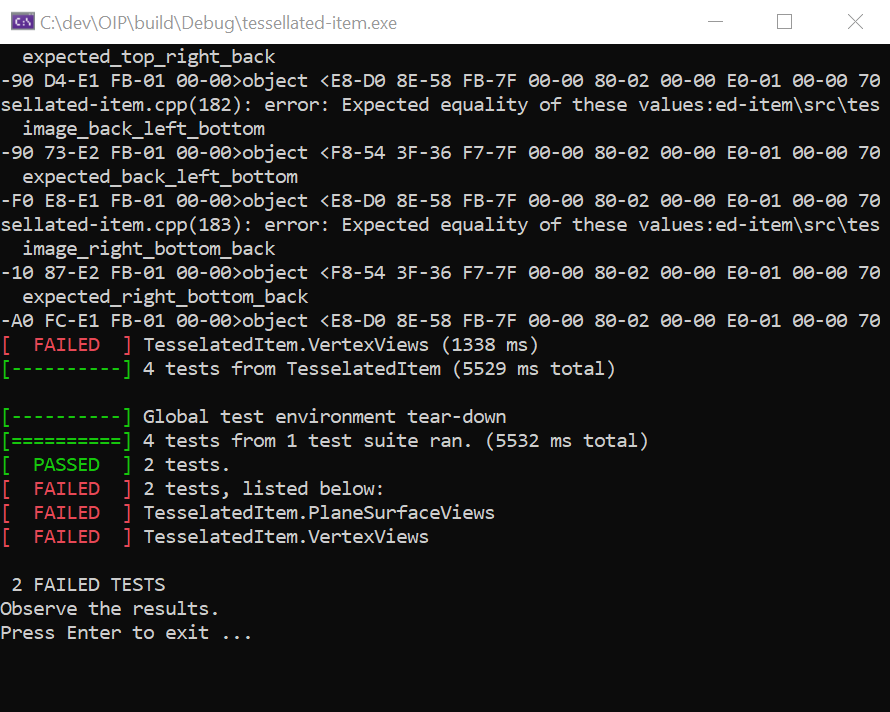

# Unit Tests

OIP already provides a set of unit tests to check continuously that even after changes 
to the code, everything is still working smoothly.
Primarily official buildingSMART IFC example files are used to check OIP for correctness
since they come with screenshots and additional information on how a correct visualization needs to 
look.
In this way, specific IfcEntities can be inspected individually for correct implementation.

Currently, the OIP unit tests are not automated and need to be run manually.
In order to run them, make sure you selected the unit test module in the CMake configuration options
(for more information on the CMake configuration, take a look at the [CMakeOptions](Documentation/markdown/CMakeOptions.md)).
After you build the early binding library, the unit tests of the corresponding IFC version will show up in the solution 
of the IDE you are using.

 

Instead of executing OpenInfraPlatform.UI as for normal use of the OIP, select a unit test of your choice as a startup 
project and execute it. This should result in a console output like this:

 

Usually, the unit tests pass without errors. 
For unit tests with known errors, Github issues were created to keep track of them and solve them over time.