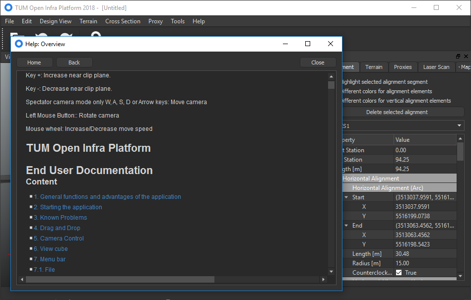

# User

*NOTE:* This documentation is out-of-sync and applies to the current state of the `master` branch (frozen somewhere in 2018).

## Installation

The application can be used by building and executing it yourself, for that please refer to the "Building" section. Otherwise there is a binary .msi installer available [here](http://oip.cms.bgu.tum.de/TUM%20Open%20Infra%20Platform.msi) installing the latest stable release. Archived versions as well as a portable installation are available on the [homepage](https://www.cms.bgu.tum.de/de/forschung/projekte/oip). We highly recommend using a portable (.zip) or executable (.msi) installer.

If the application is already installed and the installer contains a newer version, the old software is uninstalled properly and the newer version is installed.

## Using the Application

Information about how to use the OpenInfraPlatform can be found on the [homepage](https://www.cms.bgu.tum.de/de/forschung/projekte/oip) as well as in the end user documentation, available [here](https://www.cms.bgu.tum.de/oip/End%20User%20Documentation.pdf) as well as in the sources at "./docs/End User Documentation.docx". There exists a Help function in the application itself at "Help->Show Help...".

Please refer to the mailing list for bug reports and suggestions or open up an issue on [bitbucket](https://bitbucket.org/tumcms/openinfraplatform/issues?status=new&status=open).

## Updating

The application checks for new updates during startup and can download and start the installer file if a newer version is found. It is also possible via "Help->Check for updates..." in the application. This feature is currently (22.03.2018) disabled since it is still in progress.
